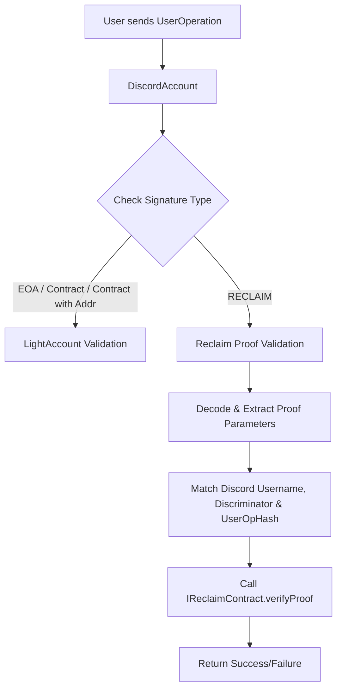
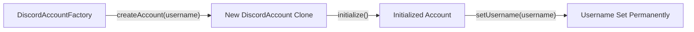

# Discord Account Abstraction

A smart contract-based account abstraction solution that integrates Discord-based verification for enhanced security and account recovery. This project leverages modern account abstraction patterns to allow users to prove ownership of a Discord identity as part of the transaction signature validation process.

---

## Overview

The system is designed to deploy and manage **DiscordAccount** instances that extend a base light account (from the [LightAccount](https://github.com/account-abstraction/light-account) library). Each account is uniquely tied to a Discord username and supports multiple signature validation methods. Notably, it introduces a custom **RECLAIM** signature type that allows users to provide a Discord reclaim proof, which is validated through a dedicated reclaim contract.

Key features include:

- **Account Abstraction:** Extends standard account abstraction techniques with custom logic.
- **Discord Verification:** Associates each account with a Discord username and enforces verification via proof parameters.
- **Multiple Signature Types:** Supports EOA, contract-based, and custom reclaim signatures.
- **Deterministic Deployment:** Uses a factory contract with deterministic clone deployment to create new accounts with predictable addresses.

---

## Architecture

### High-Level Components

- **DiscordAccount:**  
  A smart contract that implements account functionality and custom signature validation. It inherits from a base `LightAccount` and adds Discord-specific reclaim proof validation logic.

- **DiscordAccountFactory:**  
  A factory contract that deploys new `DiscordAccount` clones deterministically using the provided Discord username as a unique salt. It ensures that each account is initialized properly and associated with the correct username.

- **Reclaim Contract (IReclaimContract):**  
  An external contract (interface provided) that verifies the reclaim proofs. When a user submits a RECLAIM signature, the `DiscordAccount` calls this contract to validate the proof against expected parameters (such as the Discord username, discriminator, and timestamp).

- **LightAccount & Account Abstraction:**  
  The base account abstraction framework handles standard signature validations and user operations, with custom logic in `DiscordAccount` augmenting this behavior for Discord-based reclaim flows.

---

### Component Interaction Diagram


This diagram illustrates the flow of a user operation:

1. A **UserOperation** is sent to the `DiscordAccount`.
2. The account checks the signature type.
   - For standard types (EOA, CONTRACT, CONTRACT_WITH_ADDR), it defers to the base `LightAccount` validation.
   - For the RECLAIM type, it decodes the reclaim proof and extracts necessary parameters.
3. It validates the reclaim proof by matching the embedded Discord details and calling the external reclaim contract.
4. The validation result is then used to approve or reject the operation.

---

### Factory Deployment Diagram



This diagram shows how the DiscordAccountFactory deploys new accounts:

The factory receives a request with a Discord username.
It creates a new clone of the DiscordAccount using a deterministic salt (derived from the username).
The account is initialized and the username is set permanently (only the factory can set the username).

## Contract Details

### DiscordAccount

- **State Variables:**
  - `FACTORY_ADDRESS`: Immutable address of the factory that deployed the account.
  - `_username`: Stores the Discord username (immutable once set).
  - `RECLAIM_CONTRACT`: Address of the external reclaim contract used for verifying proofs.

- **Signature Validation:**
  - Supports an enumeration of signature types:
    - **EOA, CONTRACT, CONTRACT_WITH_ADDR:** Standard signature validations inherited from `LightAccount`.
    - **RECLAIM:** A custom mechanism that decodes a provided reclaim proof, validates JSON parameters (using regex patterns for Discord messages), and calls the reclaim contract for final verification.

- **Proof Validation Logic:**
  - Validates that the reclaim proof includes the expected parameters:
    - Correct Discord username and discriminator.
    - Matching user operation hash.
    - Valid response structure (checked against predetermined regex patterns and Discord API URL structure).
  - If all checks pass, the reclaim proof is accepted.

- **Utility Functions:**
  - `_extractParameters`: Extracts a JSON substring containing the parameters.
  - `toHexString`: Converts a bytes32 hash into its hexadecimal string representation.

### DiscordAccountFactory

- **Deployment Mechanism:**
  - Deploys `DiscordAccount` clones deterministically using the `LibClone` library.
  - The salt for deployment is generated using the keccak256 hash of the Discord username, ensuring that each account address is unique and predictable.
  
- **Account Initialization:**
  - On first creation, the account is initialized (using a burn address as a placeholder for the owner) and its username is set permanently.
  
- **Address Prediction:**
  - Provides a `getAddress` function to predict the address of a DiscordAccount based on a username without deploying it.

---

## Getting Started

### Prerequisites

- **Solidity Compiler:** Version 0.8.23 or higher.
- **Dependencies:**
  - [LightAccount](https://github.com/account-abstraction/light-account)
  - [LibClone](https://github.com/Vectorized/solady)
  - [solidity-stringutils](https://github.com/Arachnid/solidity-stringutils)
  - [OpenZeppelin Contracts](https://github.com/OpenZeppelin/openzeppelin-contracts) for ownership and access control.

### Installation & Deployment

1. **Clone the Repository:**

   ```bash
   git clone https://github.com/your-org/discord-account-abstraction.git
   cd discord-account-abstraction
   ```

2. **Install Dependencies:**

   Use your preferred package manager (e.g., npm, yarn) to install the required libraries.

   ```bash
   npm install
   ```

3. **Compile Contracts:**

   ```bash
   npx hardhat compile
   ```

4. **Deploy the Factory:**

   Deploy the `DiscordAccountFactory` by providing the required parameters:
   - Owner address.
   - Entry point address (from your account abstraction framework).
   - Reclaim contract address.

   ```bash
   npx hardhat run scripts/deployFactory.js --network <network-name>
   ```

5. **Creating a DiscordAccount:**

   Use the factory’s `createAccount` function, passing in the Discord username. This will deploy a new account (or return an existing one if already deployed).

---

## Usage

1. **User Operation:**

   When a user wants to execute an operation (transaction), they construct a `UserOperation` that includes a signature. Depending on the signature type:
   - Standard signatures are verified via the base account logic.
   - RECLAIM signatures include a reclaim proof that ties a Discord verification response to the operation.

2. **Reclaim Flow:**

   - The user generates a reclaim proof (typically by interacting with a Discord bot or similar service that posts a confirmation message).
   - The proof includes JSON data with the Discord username, discriminator, timestamp, and other required fields.
   - The `DiscordAccount` validates this proof against expected regex patterns and by calling the external reclaim contract.

